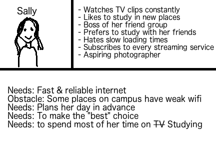

# Lab 7: User Testing Practice

Your website has information about the quality of the WiFi connection everywhere on campus. You can find it at <https://kharms.infosci.cornell.edu/teaching/info-1300/user-testing/wifi/>.

Note that this website is a draft, not a fully polished final version (it has some intentionally poor design choices). It is okay to test on this sort of website!

## Users

Your users are Cornell students who want to know about the quality of WiFi on various parts of campus.

**Sally**
- Watches TV clips constantly
- Likes to study in new places
- Boss of her friend group
- Prefers to study with her friends
- Hates slow loading times
- Subscribes to every streaming service
- Aspiring photographer

- Needs: Fast & reliable internet
- Obstacle: Some places on campus have weak WiFi
- Needs: Plans her day in advance
- Needs: To make the "best" choice
- Needs: to spend most of her time on TV Studying

## Tasks

These are the four tasks you will evaluate. Write tasks 3 and 4 based on the persona above.

**TASKS ARE NOT QUESTIONS!**

**Note**: (1) is a Task. (2) is a scenario. Scenarios are optional. Tasks are required.

1. Identify the locations with the very reliable WiFi on campus.

2. You're an undergraduate student wrapping up your junior year. Your regular study location on Campus is the President's room in Uris Library. Last week a notice was posted on the door that the WiFi will be out the following week for network upgrades. You want to find an alternative study location close by in another building that has very strong WiFi.

3. Identify an optimal place to study with other people

4. Identify locations that you would want to avoid

## Conduct a User Test

Using the procedure from the reading, user test each of the above tasks. See the lab write-up for additional instructions. **Take notes here.**

-couldn't find information on which study spots are good for other people

- was able to find places to avoid

-used the map a lot
-became confused from the map bc the map had issues but was actually able to figure it out.

## Reflection

> Which tasks (1-4) did the user successfully complete? Which tasks did the user fail to complete?

They were able to do all of the tasks except for 3, because the site was missing that information.

> What information did you get that was helpful?

It might be a good idea to include information on group size, since people like to study in different sized groups and not all places are equally good for all groups.
Also the map was missing details

> What information did you get that was not useful or relevant?

I think all of the information I got was helpful.

> What parts of the website do you think need improvement based on your user tests?

I think the map needs improvement as does the information on the different locations.

> Reflect on the tasks. Are these _good_ tasks? Did testing them result in useful data? Would you change/improve them in any way?

I think they are good tasks, they helped me learn about how useful my site was through my audience's interaction with the site. I got useful data, I might provide more context for some of the questions, and make them more like question 2. 
