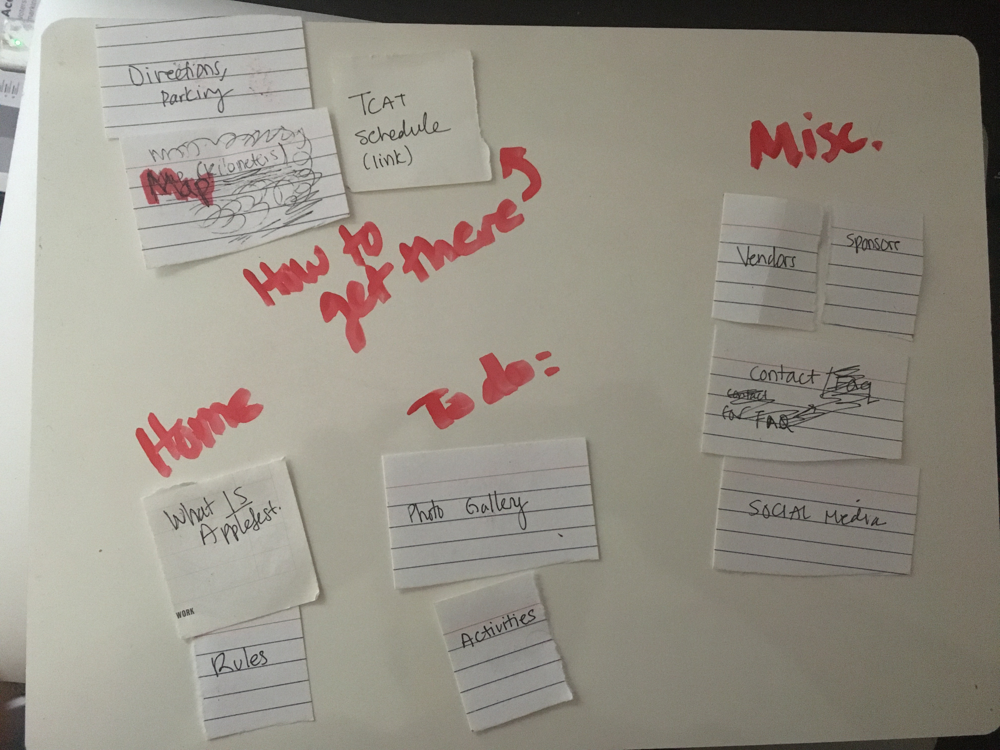
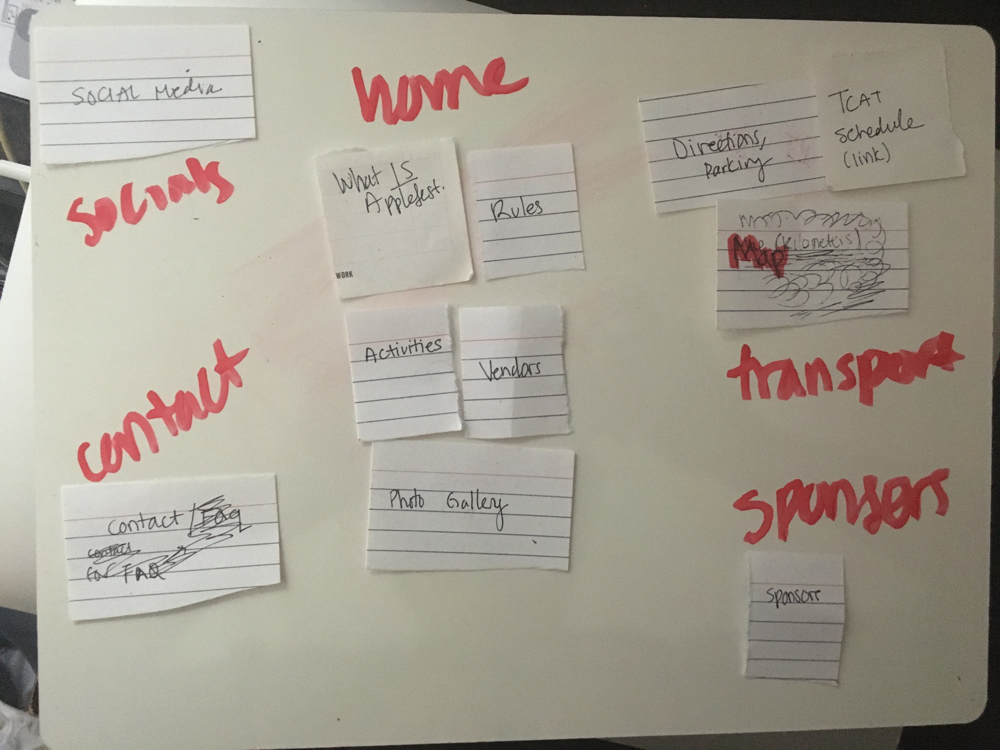
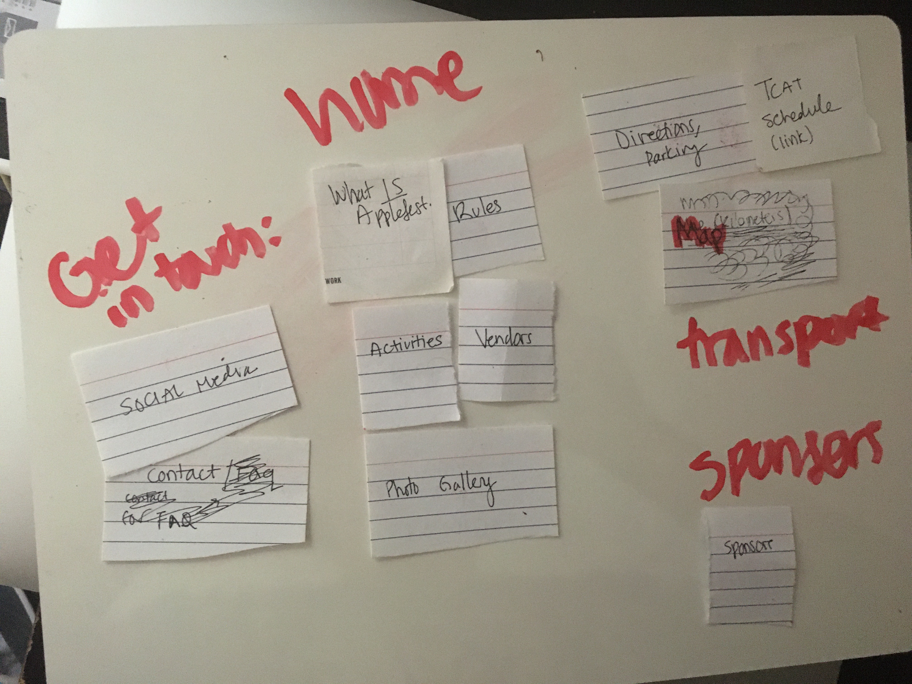
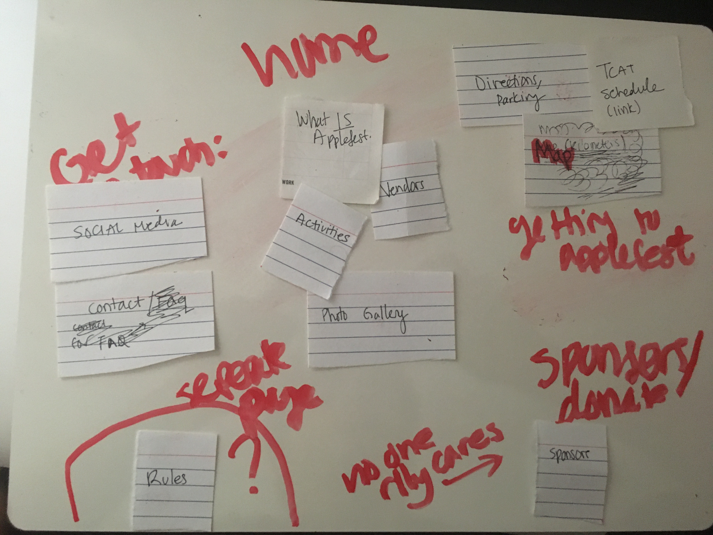
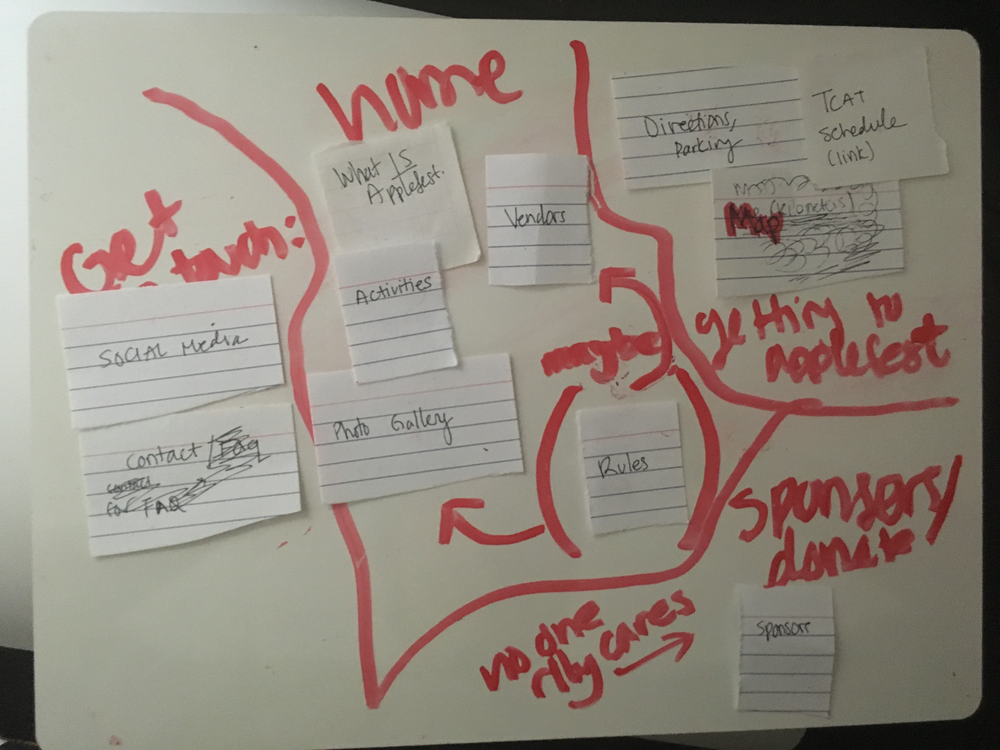

# Project 2: Design Journey

**For each milestone, complete only the sections that are labeled with that milestone.**

Be clear and concise in your writing. Bullets points are encouraged.

**Everything, including images, must be visible in Markdown Preview.** If it's not visible in Markdown Preview, then we won't grade it. We won't give you partial credit either. This is your warning.

## Design Planning

**Make the case for your decisions using concepts from class, as well as other design principles, theories, examples, and cases from outside of class.**

You can use bullet points and lists, or full paragraphs, or a combo, whichever is appropriate. The writing should be solid draft quality but doesn't have to be fancy.

### Audience (Milestone 1)
> Briefly explain who the intended audience(s) is for your website. Be specific and justify why this audience is appropriate for your site. Remember, you may not be the audience.

- Audience: Cornellians who are Canadians and live in Collegetown.
- This audience is appropriate to me because the majority of my friendgroup is Canadian (approximately 15 individuals who I will be able to interview and get feedback from) whereas I am not a Canadian. I will be able to conduct interviews and access these friends in order to complete the project, so I believe it is a good fit.

### Semi-Structured Interview Questions (Milestone 1)
> Plan your semi-structured interview which you'll use to identify the needs of your users. You are required to have a minimum of 4 questions.

Have you ever been to Applefest before?

(if yes)
1. How many times have you been to Applefest?
2. The last time you went to Applefest, recall how your process for planning your itinerary.
3. How did you travel to and from Applefest
4. Recall what types of things you did during Applefest.

(if no)
1. For what reason have you never been to Applefest?
2. What types of foods/products derived from apples have you historically shown interest towards?
3. How do you normally travel to Ithaca Commons in late September?

### Interview Notes (Milestone 1)
> Interview at least 2 people from your audience. Take notes and include those notes here. Make sure to include a brief description of each interviewee.

Interviewee 1:

description:
- Canadian living in Collegetown (Ctown)
- 20 years old

notes:
- has not been to Applefest
- did not go because he didn't know what Appplefest was
- has historically enjoyed apples, apple-drinks, apples and cinnamon oatmeal, and apple pie
- has historically travelled to Ithaca Commons by private vehicle.

Interviewee 2:

description:
- From Minnesota, but is a Canadian citizen.
- Lives in Collegetown
- 22 years old.

notes:
- has not been to Applefest
- didn't attend Applefest because he didn't know about it.
- has historically enjoyed apple sauce, apple juice, apples, apple pie.
- travels to Ithaca Commons by car

Interviewee 3:

description:
- Canadian living in Ctown
- 21 years old

notes:
- has not been to Applefest
- did not go because has never heard of Applefest
- has historically enjoyed apples, apple juice, apple pie
- has historically travelled to Ithaca Commons by car.

### Needs (Milestone 1)
> Analyze your audience's needs and wants from your notes above. List each need/want below. There is no specific number of needs required for this, but you need enough to do the job.

Need/Want 1: Knowledge of what Applefest is
- **Needs and Wants** _What does your client and audience need and want?_
  - My client and audience needs knowledge of what Applefest is, and how to participate in Applefest
- **Design Ideas and Choices** _How will you meet those needs and wants?_
  - I will meet this need by including a robust "About" section and well-developed Home-page where one can learn about Applefest
- **Rationale & Additional Notes** _Justify your decisions; additional notes._
  - This lack of knowledge may be beyond the controll of the Applefest site itself, but it wouldn't hurt to make sure the site is informative
  - The site needs to help inform about what applefest is, since perhaps in Canadian culture, apples do not occupy the same "cultural niche" as they do in the U.S.

Need/Want 2: Access to apple-derived foods/drinks
- **Needs and Wants** _What does your client and audience need and want?_
  - My audience has demonstrated a need for knowledge of where to find apple related foods/drinks and what will be available.
- **Design Ideas and Choices** _How will you meet those needs and wants?_
  - I will meet this need by including a section of the vendors that will be present
- **Rationale & Additional Notes** _Justify your decisions; additional notes._
  - Applefest is primarily centered around apple consumption; my audience has demonstrated an interest thereof, therefore it will be useful for them to see if the foods and drinks they enjoy will be available
Need/Want 3: Directions and Parking
- **Needs and Wants** _What does your client and audience need and want?_
  - My audience needs knowledge of where they can park, and how to get there.
- **Design Ideas and Choices** _How will you meet those needs and wants?_
  - I will meet this need by including a section on directions and parking.
- **Rationale & Additional Notes** _Justify your decisions; additional notes._
  - Because all of my interviewees said that they travel by car to Ithaca Commons, and this is where Applefest takes place, they should have access to information about parking and directions.
  - Since they are Canadian, information should be in kilometers not miles.

### Initial Design (Milestone 1)
> Document your design process. Show us your card sorting. Describe your theme. Show us sketches of your site (mobile and desktop versions). etc. You should show us how your came up with your design and how your iterated on that design; show us the evolution of your design.

Here is my card sorting:

In my card sorting, I attempted to explore different layouts that could be helpeful to my audience. In the end I chose the card sort 5, because it's the most user-centered: I ended up getting rid of the "Covid-19 Rules" section, since this site is being designed for next year, where hopefully there will be a vaccine and therefore we won't need those rules. I also made "sponsors" its own page since my audience doesn't really about that, so I don't want it to clutter other, more useful pages. I decided to lump social media and contact information together in the "get in touch with us" section, since if they had their own sections it felt a little too cluttered for me. My "getting to Applefest" section is intuitive because it includes a map, bus information, as well as parking/directions. The home page is also appropriate: it includes photos so people who are visual learners know what to expect, and information on the activities as well as vendors (the people operating the different stands). I noticed that my audience knew very little about Applefest, so I made sure to create a new section for the home page to explain what Applefest is.

Next, I had to think about layout. These are my sketches, first for the computer version, and next for the mobile version:

(something at the top was cut off, but it just sayd that I had optimistically decided to not include a "covid rules" section )

As you can see, these layouts are relatively similar; the mobile design is simply longer, since the screen is smaller, and thus would involve more scrolling to access the same information. I believe that my layout is user-friendly and intuitive. It's pretty standard and simple in my opinion but it will do the trick; The home page prioritizes the question of "what is Applefest?" since in my interviews, I noticed that this was a big question. The home page also will include photos alongside information on activities and vendors so that my users will have a better idea of what is going on. The contact page prioritizes the actual contact information, since social media is a great place to get in touch, but is less pressing than a serious matter. The sponsors page is relatively straightforward, as is the "getting to Applefest" page, for which I added the "quick links" section at the top; because some people might need this information, and I didn't want it to get lost beneath the main content on parking and directions.

Regarding design, I have decided to go with a sans-serif font, for a more modern feel; comic-sans could also be appropriate but this didn't match my target audience age-range. For colors, I will use fall-themed colors since I feel like this suits the purpose well: greens, reds, oranges, browns, and yellows. I haven't finalized these plans, but I do have a clear idea on what I would like: it's just a matter of trying these colors to see which combination thereof produces the optimal atmosphere.

## Design

### Final Design (Milestone 2)
> Include the final sketches for each of your pages.

**Desktop Design:**
The multiple sketches are on top of each other in different colored inks.

However, in the end it didnt make sense to include the hours/dates with the photo gallery, so I decided to not do that.

**Mobile Design:**
I don't have multiple sketches for the final mobile design, because things largely fell into place as I was designing the desktop design.

As you can see, the result is tha the gallery switches to fill all the screen below the rest of the information.

### Design Rationale (Milestone 2)
> Explain why your design is appropriate for your audience. Specially, why does your content organization, navigation, and site design/layout meet the needs of your users?

My design is approprate for my audience of people from outside the US who live in Collegetown, because in addition to using the metric system, I took information from past sites of Applefest in which its organizers did a more thorough job explaining what it was, and its cultural significance to people who are from the area. My organization also reflects my sensitivity to my audience: I didn't want "sponsors" to clutter a more important page, so I made it its own page. However, I wasn't sure where to put the photo gallery, so I included it as an aside on all of the pages since in my opinion, it makes all of the pages look more visually appealing. The contact infomation section is very straight forward and puts the more important contact information just above social media links. The travel page is useful and tailored to my audience since it explains that walking is perhaps the best option to get to Applefest from Collegetown, but also provides bus and parking information if members of the audience in some cases would prefer to drive.

The photos I picked do a good job representing fall and what goes on at applefest so that people who aren't from the United States have a better sense of what it is.

### Responsive Design Considerations (Milestone 2)
> Explain how you adapted your design to be responsive (support both mobile and desktop versions).

My design is responsive because it supports mbile and desktop versions: the layout changes when you go from desktop to mobile; further the background images zoom in and out to accomodate different screen sizes. If they were static, the screen would have a lot of white space on larger desktops. Originally, I didn't like the zoom feature, but I've found that it's cool since as the browser window gets narrower, more of the image is revealed.

### Coded Draft Desktop Website (Milestone 2)
> Include screenshots of the draft version of your desktop design AND your mobile design. Include a screenshot for every page. If you're using Firefox, click the 3 dot button in the address bar and select "Take a Screenshot."

**Desktop Screenshots:**
Here are the desktop screenshots:

**Mobile Screenshots:**
As you can see, it is not 100% perfect, but in my understanding this was not expectation, and it was more just to do as much as we could. I think it's a decent start:

## User Testing (Round 1)

### User Testing Plan (Milestone 3)
> Plan out your user testing tasks before doing your user testing. These must be actual user testing tasks. **Tasks are not questions!**

1. You decide to walk to Applefest from your Collegetown apartment, find out the best way to get there.

2. Identify the fax information for the organizers of Applefest.

3. Identify the food staples that will be found at Applefest.

### User 1 - Testing Notes (Milestone 3)
> When conducting user testing, you should take notes during the test. Place your notes here.

- used mouse to draw line showing how he would navigate to Applefest ("Ithaca Commons")
- successfully located the correct fax information for Applefest
- identified the food staples on the home page

### User 1 (Milestone 3)
> Using your notes from above, describe your user by answering the questions below.

1. Who is your user, e.g., where does the user come from, what is the user's job, characteristics, etc.?

User is a Canadian sophomore male. He is 20 years old, is an ILR major, and lives in Collegetown.

2. Does the user belong to your audience of the site? (Yes / No)
> If “No”, what’s your strategy of associating the user test results to your audience’s needs and wants? How can your re-design choices based on the user tests make a better fit for the audience?

Yes, he does.

### User 1 (Milestone 3)
> Report the results of your user's test. You should explain **what the user did**, describe the user's **reaction/feedback** to the design, **reflect on the user's performance**, determine what **re-design choices** you will make **for EACH task**. You can also add any additional comments. See the example design journey for an example of what this would look like.

Task: 1
- **Did you evaluate the desktop or mobile design?**
  - desktop
- **How did the user do? Did they meet your expectation?**
  - Yes, he met my expectations.
- **User’s reaction / feedback to the design** (e.g., specific problems or issues found in the tasks)
  - There weren't any specific problems, he got closer to the screen to see the map however.
- **Your reflections about the user’s performance to the task**
  - Overall, it was what I expected because I had known that the map wasn't super clear. I think it was a good and straightforward task, and he followed it according to my expectations.
- **Re-design choices**
   - Make map bigger/clearer.
- **Additional Notes**
  - Map should be PNG not JPG

  Task: 2
  - **Did you evaluate the desktop or mobile design?**
    - desktop
  - **How did the user do? Did they meet your expectation?**
    - Yes, he met my expectations.
  - **User’s reaction / feedback to the design** (e.g., specific problems or issues found in the tasks)
    - He deduced that this must be in "Contact Information" and successfully navigated there.
  - **Your reflections about the user’s performance to the task**
    - Overall, it was what I expected, yes. However, I anticipated more confusion because many people don't know what fax is.
  - **Re-design choices**
     - No redesign choices.
  - **Additional Notes**
    - He found it very quickly, I'm not sure how I could have made it easier.

    Task: 3
    - **Did you evaluate the desktop or mobile design?**
      - Desktop
    - **How did the user do? Did they meet your expectation?**
      - The user did very well, and met my expectations.
    - **User’s reaction / feedback to the design** (e.g., specific problems or issues found in the tasks)
      - There weren't any specific problems, obviously, he had to scan the home page to find the right information so it was "instant" because the information I asked for was really specific and required reading through (this was what I wanted my users to do).
    - **Your reflections about the user’s performance to the task**
      - It was what I expected, he did a good job identifying what I was asking him to.
    - **Re-design choices**
       - None for this.
    - **Additional Notes**
      - (Not applicable)

### User 2 - Testing Notes (Milestone 3)
> When conducting user testing, you should take notes during the test. Place your notes here.
 (I tested mobile for him, but desktop for the first user)
- had trouble finding things; because mobile was incomplete.
- other than the reduced navigability, he found everything well. Again, the map was too small. Essentially the same as user 1, he noted that fax was a weird thing for me to ask him for, but found the fax info quite easily.

### User 2 (Milestone 3)
> Using your notes from above, describe your user by answering the questions below.

1. Who is your user, e.g., where does the user come from, what is the user's job, characteristics, etc.?

- 22 year old senior living in Collegetown.
- AEM major.
- Male.
- British but lived in the US since he was 15.

2. Does the user belong to your audience of the site? (Yes / No)
> If “No”, what’s your strategy of associating the user test results to your audience’s needs and wants? How can your re-design choices based on the user tests make a better fit for the audience?

Yes, because he's a foreign student living in Ctown.

### User 2 (Milestone 3)
> Report the results of your user's evaluation. You should explain **what the user did**, describe the user's **reaction/feedback** to the design, **reflect on the user's performance**, determine what **re-design choices** you will make **for EACH task**. You can also add any additional comments. See the example design journey for an example of what this would look like.

Task: 1
- **Did you evaluate the desktop or mobile design?**
  - Mobile!
- **How did the user do? Did they meet your expectation?**
  - Had trouble navigating because of my mobile design. I expected this. He said the map was too big for the page, and that is was blurry and hard to use.
- **User’s reaction / feedback to the design** (e.g., specific problems or issues found in the tasks)
  - (See above) Had some difficulties; gave me good feedback.
- **Your reflections about the user’s performance to the task**
  - This all makes sense to me
- **Re-design choices**
  - Edit mobile layout
  - Make the map more user-friendly
- **Additional Notes**
  - All aspects of my mobile design must fit the screen; map to be PNG.

Task: 2
- **Did you evaluate the desktop or mobile design?**
  - My mobile design.
- **How did the user do? Did they meet your expectation?**
  - They met my expectations, they did well. Only issue is my mobile design.
- **User’s reaction / feedback to the design** (e.g., specific problems or issues found in the tasks)
  - (See above); he had trouble with my design. Laughed when I asked for fax; said it was unusual (but I knew this).
- **Your reflections about the user’s performance to the task**
  - I expected this, he did well given my un-finished design.
- **Re-design choices**
  - Make the mobile layout more useable.
- **Additional Notes**
  - (N/A).

Task: 3
- **Did you evaluate the desktop or mobile design?**
  - Mobile.
- **How did the user do? Did they meet your expectation?**
  - Same as above, He did really well, had trouble with my layout.
- **User’s reaction / feedback to the design** (e.g., specific problems or issues found in the tasks)
  - Didn't like my layout, but I anticipated this since it wasn't completely done.
- **Your reflections about the user’s performance to the task**
  - I'll work on making my layout for mobile work better for my audience.
- **Re-design  choices**
  - (See above).
- **Additional Notes**
  - (N/A)

### Changes Based on User Testing (Milestone 3)
> What changes did you make to your design based on user testing?
- Making the map clearer (png not jpg)
- Fine-tuning mobile design to be more coherent and user-friendly.

## User Testing (Round 2)

### Finished Desktop & Mobile Website (Final Submission)
> Include screenshots of both the desktop and mobile version of your site that you will be using for user testing.

**Desktop Screenshots:**

**Mobile Screenshots:**

### User Testing Plan (Final Submission)
> Plan out your user testing tasks before doing your user testing. These must be actual user testing tasks. **Tasks are not questions!**
> These should be the same tasks from round 1.

1. You decide to walk to Applefest from your Collegetown apartment, find out the best way to get there.

2. Identify the fax information for the organizers of Applefest.

3. Identify the food staples that will be found at Applefest.

### User 3 - Testing Notes (Final Submission)
> When conducting user testing, you should take notes during the test. Place your notes here.

- was very conversational.
- pointed out that the "|" divider on the hours was unclear.
- had an easy time navigating through the site
- laughed when I asked for her to find the fax information.
- said that my font was really small.
- completed all my tasks successfuly but gave a lot of feedback while completing my tasks.

### User 3 (Final Submission)
> Using your notes from above, describe your user by answering the questions below.

1. Who is your user, e.g., where does the user come from, what is the user's job, characteristics, etc.?

- Cornell junior
- from Belgium
- lives in Collegetown
- is an art major
- female, 20 years old.

2. Does the user belong to your audience of the site? (Yes / No)
> If “No”, what’s your strategy of associating the user test results to your audience’s needs and wants? How can your re-design choices based on the user tests make a better fit for the audience?

Yes because she's a foreign student living in Collegetown.

### User 3 (Final Submission)
> Report the results of your user's test. You should explain **what the user did**, describe the user's **reaction/feedback** to the design, **reflect on the user's performance**, determine what **re-design choices** you will make **for EACH task**. You can also add any additional comments. See the example design journey for an example of what this would look like.

Task 1:  You decide to walk to Applefest from your Collegetown apartment, find out the best way to get there.
- **Did you evaluate the desktop or mobile design?**
  - desktop
- **How did the user do? Did they meet your expectation?**
  - Yes, she met my expectations and had ease using the map (wasn't a huge issue for the user who used the desktop version last time, but wanted to make not of that)
- **User’s reaction / feedback to the design** (e.g., specific problems or issues found in the tasks)
  - She didn't have any specific problems.
- **Your reflections about the user’s performance to the task**
  - She navigated there quickly, and commented that she liked the diffferent photos on the site.
  - Gave a lot of good feedback irrelevant to the specific task.
- **Re-design choices**
  - None, my redesign choice seems to be successful.
- **Additional Notes**
  - No additional notes.

Task 2: Identify the fax information for the organizers of Applefest.
- **Did you evaluate the desktop or mobile design?**
  - desktop
- **How did the user do? Did they meet your expectation?**
  - Yes, she did a good job with this task and met my expectations. She thought that it was a strange task for me to ask. I realized that maybe this task wasn't a great thing to ask, but had to keep the question the same, and for practical purposes, if one can locate the fax information, it's in the same spot as more common media of communication like telephone and email, so I think it is alright overall.
- **User’s reaction / feedback to the design** (e.g., specific problems or issues found in the tasks)
  - (See above) => no major issues
- **Your reflections about the user’s performance to the task**
  - She like the photo at the top of the contact information page,
  - She did this task quite quickly
- **Re-design choices**
  -  no redesign choices
- **Additional Notes**
  -  N/A

Task :
 Identify the food staples that will be found at Applefest.
- **Did you evaluate the desktop or mobile design?**
  - Pick one: desktop
- **How did the user do? Did they meet your expectation?**
  - She met my expectations and located the information
- **User’s reaction / feedback to the design** (e.g., specific problems or issues found in the tasks)
  - Said the font was "so small" and also pointed out that the "|" symbol looked like a capital "i"
  - Located information quikcly nonetheless
- **Your reflections about the user’s performance to the task**
  - I think she made a good point about font size and also the "|"
  - She completed the task itself quite quickly though
- **Re-design choices**
  - make font size larger
  - revise the "hours" section
- **Additional Notes**
  - font size should probably also be larger for mobile design as well.

### User 4 - Testing Notes (Final Submission)
> When conducting user testing, you should take notes during the test. Place your notes here.

- navigates the site easily
- not much feedback
- not super invested/engaged.
- however, did walk me through his thought process when navigating the site "so I'm going to click over here.... and then...." etc.

### User 4 (Final Submission)
> Using your notes from above, describe your user by answering the questions below.

1. Who is your user, e.g., where does the user come from, what is the user's job, characteristics, etc.?

- 21 y/o Canadian male
- lives in Ctown
- in the hotel school
- has bad eyesight (notably bad eyesight)

2. Does the user belong to your audience of the site? (Yes / No)
> If “No”, what’s your strategy of associating the user test results to your audience’s needs and wants? How can your re-design choices based on the user tests make a better fit for the audience?

Yes, he does.

### User 4 (Final Submission)
> Report the results of your user's evaluation. You should explain **what the user did**, describe the user's **reaction/feedback** to the design, **reflect on the user's performance**, determine what **re-design choices** you will make **for EACH task**. You can also add any additional comments. See the example design journey for an example of what this would look like.

Task 1: You decide to walk to Applefest from your Collegetown apartment, find out the best way to get there.
- **Did you evaluate the desktop or mobile design?**
  - mobile
- **How did the user do? Did they meet your expectation?**
  - navigated to this easily, was able to use the map despite poor eyesight. (my expectations were met)
- **User’s reaction / feedback to the design** (e.g., specific problems or issues found in the tasks)
  - said that the website was "neat".
  - wasn't very chatty so very little "inadvertant feedback" as opposed to User 3 :/
- **Your reflections about the user’s performance to the task**
  - good performance, was very quick and walked me through his thought process (was in essence what I was hoping for)
- **Re-design choices**
  none
- **Additional Notes**
  - n/a

Task 2: Identify the fax information for the organizers of Applefest..
- **Did you evaluate the desktop or mobile design?**
  - mobile
- **How did the user do? Did they meet your expectation?**
  - the user did what I expected, the user did a good job and located the fax information and read the number.
  - he commented on my small font.
- **User’s reaction / feedback to the design** (e.g., specific problems or issues found in the tasks)
  - simply said that the font was small
- **Your reflections about the user’s performance to the task**
  - I agree with my user, my font is somewhat small
- **Re-design choices**
  - make font bigger
  - make line spacing bigger
- **Additional Notes**
  - (just have to be careful to make sure to make the small font bigger, not all font uniformly large)

Task 3: Identify the food staples that will be found at Applefest.
- **Did you evaluate the desktop or mobile design?**
  - mobile
- **How did the user do? Did they meet your expectation?**
  - yes, he did a good job and met my expectations.
- **User’s reaction / feedback to the design** (e.g., specific problems or issues found in the tasks)
  - read off to me the food staples,
  - said they seemed tasty
  - did a good job communicating his thought process to me
  - nothing super notable
- **Your reflections about the user’s performance to the task**
  - it was what I expected
- **Re-design choices**
  - should just make font bigger since it's just as small as the fax informatin font
- **Additional Notes**
  - no

### Changes Based on User Testing (Final Submission
> What changes did you make to your design based on user testing?

I decided to make the font larger, and also to clear up the ambiguity regarding the "|" symbol

## Self-Reflection (Final Submission)
> This was the first project in this class where you were able to follow a user-centered design process from start to finish. What did you learn from this experience?

I really liked being able to interact with my users, it's honestly a pretty rewarding experience. They all gave me helpful feedback, and I was able to improve my site based on their feedback. These improvements are things that I never would certainly not have been able to catch on my own, and so I really did need their input.

Also, I learned that users all give feedback in different ways, whether it's direct or indirect feedback! This makes sense because all my users, although they share some things in common, are all individual people who have different personalities and on some level do interact with the site differently.

> Take some time here to reflect on how much you've learned since you started this class. It's often easy to ignore our own progress. Take a moment and think about your accomplishments in this class. Hopefully you'll recognize that you've accomplished a lot and that you should be very proud of those accomplishments!

I didn't know anything about coding before this class, and I've progressed a lot. I'm really proud of myself and am glad that people like my site. It was fun!
